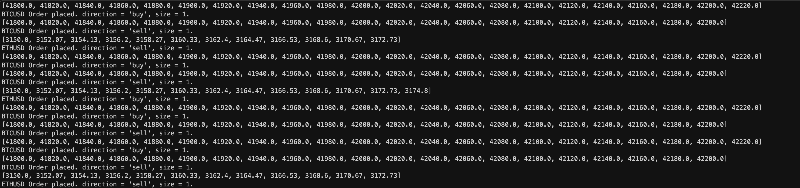

# Grid Trader

A fully autonomous stock and crypto grid trader. Supports multi-asset and multi-account deployment, allowing you to simultaneously deploy Grid Traders using separate CPU cores. GridTrader is lightweight, whose only dependency is Alpaca's trade execution API, as all other operations are computed locally. 

Below is an example deployment of two grid traders, for Bitcoin and Ethereum.

```python
import gridtrader

def main():
    """Top level main execution function."""
    eth_trader = gridtrader.GridTrader(
        symbol = 'ETH/USD',
        trading_range = (2950, 2975),
        grids_amount = 26,
        quantity = 26,
        asset_class = 'crypto'
    )

    btc_trader = gridtrader.GridTrader(
        symbol = 'BTC/USD',
        trading_range = (15200, 15300),
        grids_amount = 51,
        quantity = 51,
        asset_class = 'crypto'
    )

    # Start the GridTraders simultaneously
    mp.Process(target=eth_trader.deploy).start()
    mp.Process(target=btc_trader.deploy).start()
```

## Features

All features listed below are fully functional and have been tested in deployment in early 2022.

### Simultaneous Deployment

Multiple grid traders (for the same or different assets) can be deployed simultaneously, using different cores (multiprocessing). This allows each individual bot to run with a full performance capacity. 

Further

It's recommended to leave one core free per grid trader, as grid traders distribute order execution tasks to further separate core, thereby allowing it continue actively monitoring the underlying, unhindered. 

Below is an example of creating and running two bots simultaneous in individual cores.

```python
def main():
    """Top level main execution function."""
    # Deploy Bitcoin
    btc_trader = GridTrader(
        symbol = 'BTCUSD',
        trading_range = (41800, 42400),
        grids_amount = 31,
        account_allocation = 0.5,
        asset_class = 'crypto'
    )
    mp.Process(target = btc_trader.deploy).start()

    # Deploy Ethereum
    btc_trader = GridTrader(
        symbol = 'ETHUSD',
        trading_range = (2750, 2850),
        grids_amount = 31,
        account_allocation = 0.5,
        asset_class = 'crypto'
    )
    mp.Process(target = btc_trader.deploy).start()

```

Grid traders print order information to console when they place trades. This still works with multiprocessing.



### Position Sizing

Grid Traders can be deployed either using notional values or quantities. Notional values will submit fractional orders to meet the dollar value of the `account_allocation`. A `quantity`, however, will be constant. 

It's crucial to note that `account_allocation` and `quantity` are mutually exclusive. At least one of them _must_ be provided, but both cannot.

Below are all the parameters for Grid Trader along with their necessities and behaviors. 

| Parameter | Necessity | Behavior |
| --- | --- | --- |
| `symbol` | Required | String - the symbol Grid Trader will trade. Should be given alongside `asset_class`. |
| `asset_class` | Optional | String - either `'stock'` or `'crypto'`. Defaults to `'stock'`. Necessary for the bot's data collection function. |
| `trading_range` | Required | Tuple - two items. The first is the range bottom, the second is the range top. |
| `grids_amount` | Required | Integer - the number of grids for the bot to split the range equally into. Inclusive. So, to split a $100 range into 10 equal zones, pass `grids_amount = 11`. |
| `alpaca` | Optional | Alpaca API REST - Instantiate and pass in your own Alpaca object if you want to specify the account in which the GridTrader operates in. If you don't pass anything in, the GridTrader will operate in the account specified by your `keys.ini` file. |
| `account_allocation` | Mutually exclusive with `quantity` | Float - the proportion of the account that should be allocated to the entire strategy. If every single grid is triggered, this is the maximum amount a portfolio will be used. |
| `quantity` | Mutually exclusive with `account_allocation` | Int - the number of shares to be allocated to the strategy. Note that this will _still_ result in orders being divided by grid. |
| `top_profit_stop` | Optional | Float - the _maximum_ take-profit for sells and stop-loss for buys. If Grid Trader breaks the range _high_, this is the stop-out/profit exit point. Defaults to one grid _higher_ than the grid range. |
| `bottom_profit_stop` | Optional | Float - the _minimum_ take-profit for sells and stop-loss for buys. If Grid Trader breaks the range _high_, this is the stop-out/profit exit point. Defaults to one grid lower than the grid range. |

### Default Bot Creation

Because the `GridTrader` classes requires so many inputs, some of which are mutually exclusive, the global `create_default_bot()` function can be useful. It takes only a few parameters, infers/calculates the others, and returns a `GridTrader` object ready for deployment. 

The main benefit of this function, however, is that it automatically outputs a bot whose range is perfectly centered around the symbol's current price.

Arguments for `create_default_bot()`:

| Parameter | Necessity | Behavior |
| --- | --- | --- |
| `symbol` | Required | String - the symbol Grid Trader will trade. |
| `grid_height` | Required | Float - half the total width of the range. This function outputs a bot whose range is perfectly centered around the symbol's current price. |
| `grids_amount` | Optional | Int - the number of grids to be divided in the range. Defaults to 21. |
| `account_allocation` | Mutually exclusive with `quantity` | Float - the proportion of the account that should be allocated to the entire strategy. If every single grid is triggered, this is the maximum amount a portfolio will be used. |
| `alpaca` | Optional | Alpaca API REST - Instantiate and pass in your own Alpaca object if you want to specify the account in which the GridTrader operates in. If you don't pass anything in, the GridTrader will operate in the account specified by your `keys.ini` file. |
| `quantity` | Mutually exclusive with `account_allocation` | Int - the number of shares to be allocated to the strategy. Note that this will _still_ result in orders being divided by grid. |

Creating and deploying a bot using the `create_default_bot()` function:

```python
def main():
    # Deploy Ethereum with default bot function
    eth_trader = create_default_bot(
        symbol = 'ETHUSD',
        grid_height = 75,
        grids_amount = 15,
        quantity = 7
    )
    mp.Process(target = eth_trader.deploy).start()
```

## File Structure

### main.py

User script. Create all desired GridTrader, and optionally, instantiate any Alpaca REST objects for accounts not specified in `keys.ini`. Then, use `mp.Process(target=btc_trader.deploy).start()` to start each grid trader. 

### keys.ini

Contains Alpaca login credentials. The following items must be provided:

```ini
[Alpaca]
api_key = 'KEY'
api_secret = 'SECRET'
base_url = 'BASE_URL_ENDPOINT'
```

### requirements.txt

All the package requirements for running Grid Trader. Note that Grid Trader was developed using Python 3.10.6. Currently, the only dependency is Alpaca's trading API, as all mathematical operations are calculated locally. To install all dependencies:

```bash
python3.10 -m pip install -r requirements.txt
```
